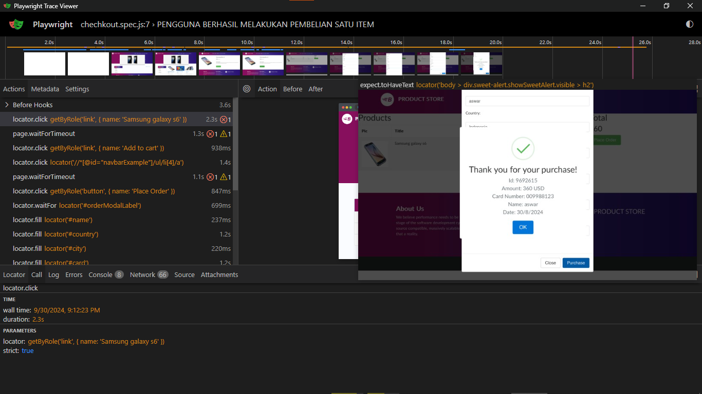
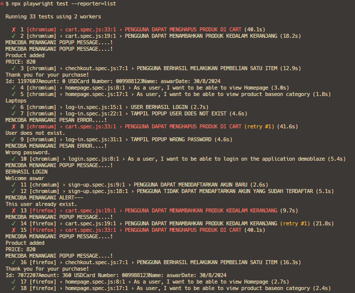
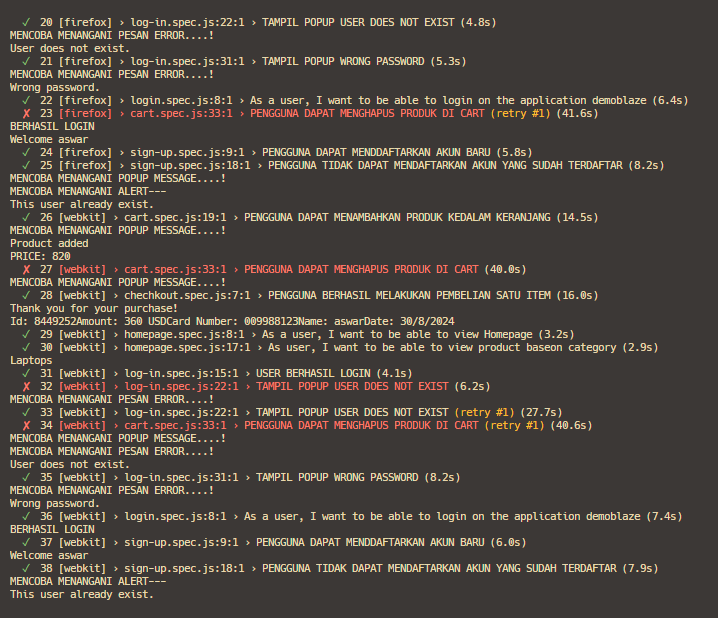

# DEMOBLAZE PROJECT Take Home Test

DemoBlaze is an e-commerce website that is currently in very early development stages. The MVP for this website was creating a login feature and a homepage showcasing a list of items. But now it has been developed with the following features:

## Features
- Daftar
- Login/Logout
- Keranjang
- Checkout

## Report
1. Trace Viewer

### 1. Timeline
Timeline memungkinkan Anda melihat snapshot untuk setiap perilaku yang ada. Perilaku yang gagal akan ditandai dengan warna berbeda, memudahkan identifikasi kejadian yang tidak berhasil.

### 2. List
#### a. List Action
Memilih salah satu kejadian akan menampilkan gambaran lengkap mengenai kejadian tersebut di sisi kanan layar.

#### b. List Metadata
Menampilkan informasi terkait waktu, jenis browser, ukuran viewport, dan informasi tambahan lainnya yang berkaitan dengan kejadian tersebut.

### 3. Snapshot
Snapshot adalah tampilan yang menunjukkan kejadian pada berbagai tahap, seperti Action, Before, dan After. Anda dapat melihat bagaimana keadaan sebelum dan sesudah kejadian terjadi.

### 4. Bottom Section
Bagian bawah aplikasi menyediakan beberapa tab yang membantu dalam analisis lebih lanjut:

- **Locator:** Saat Anda mengarahkan kursor pada elemen di Snapshot, locator elemen tersebut akan ditampilkan.
- **Call:** Informasi tentang setiap kejadian, termasuk elemen waktu, parameter, dan locator yang digunakan.
- **Log:** Menunjukkan rincian kejadian yang terjadi selama proses, seperti menunggu locator atau menekan handler.
- **Errors:** Informasi tentang kesalahan yang terjadi, termasuk:
  - Jika menggunakan VSCode, ada tautan yang menunjukkan alamat error.
  - Tampilan pesan error.
  - Locator yang diharapkan dan realita yang terjadi.
- **Console:** Pesan-pesan yang terjadi antara browser dan file tes, dengan ikon yang membedakan keduanya.
- **Network:** Menampilkan semua hasil permintaan jaringan, respons, dan body.
- **Source:** Sumber kode dari setiap kejadian ketika dipilih.
- **Attachments:** Lampiran yang terkait dengan kejadian yang dipilih.

2. List Reporter

